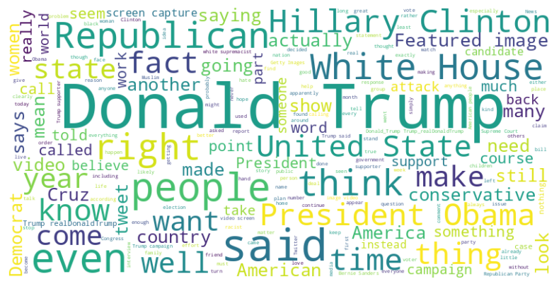
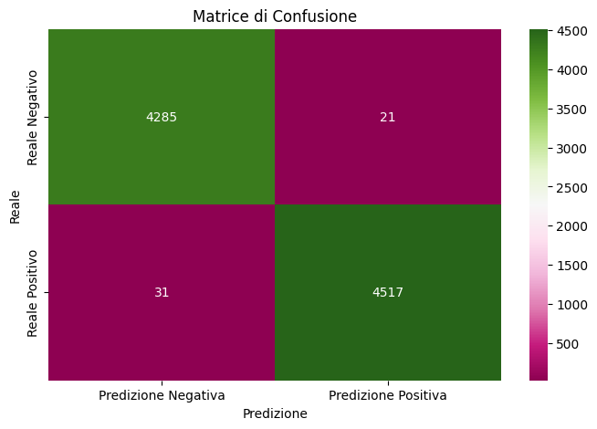
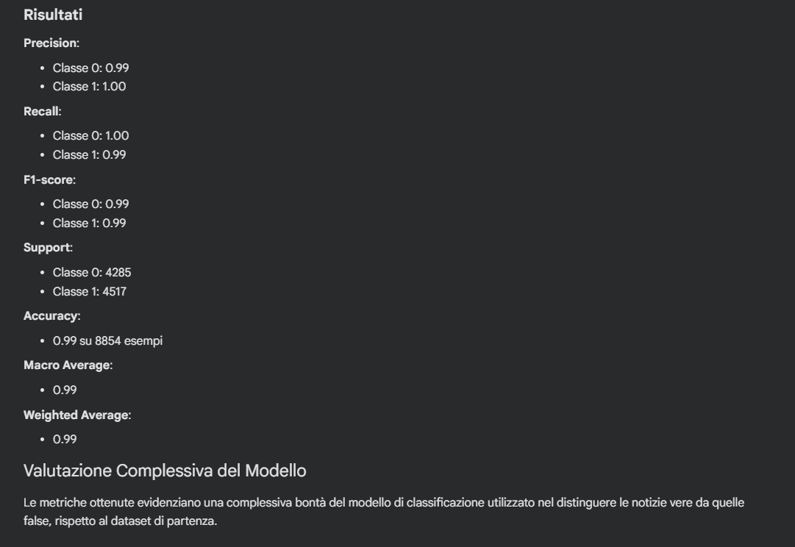

# NLP Fake News Detector for Chrome Extension 🕵️‍♂️🇺🇸
Questo progetto rappresenta il caso studio finale per il modulo di **Natural Language Processing**, realizzato all'interno del mio percorso di **Master Professionale in Data Analytics certificato da ProfessionAI e Alteredu**.

## 🎯 Visione del Progetto
In un'epoca segnata dalla disinformazione, questo progetto mira a fornire uno strumento di difesa tecnologica per gli utenti web. Sviluppato con l'obiettivo di essere integrato in un **Plug-in per Google Chrome** per conto del **Governo degli Stati Uniti**, il modello analizza in tempo reale il testo delle notizie per classificarle come "Vere" o "False".

## 📊 Analisi Esplorativa e Risultati
L'analisi si è concentrata sull'identificazione di pattern linguistici ricorrenti e sulla creazione di un modello predittivo ad alta precisione.

### Word Cloud dei termini ricorrenti
La "palla di parole" sottostante evidenzia i termini più frequenti estratti dai dataset di analisi, mostrando visivamente i topic maggiormente soggetti a fenomeni di disinformazione:

  

### Performance del Modello
Il classificatore **SVM** ha raggiunto un'accuratezza del **99%**. Di seguito, la matrice di confusione e il report dettagliato delle metriche (Precision, Recall, F1-Score) esportati direttamente dall'ambiente di sviluppo:

  
  

## 🛠️ Stack Tecnologico e Pipeline
* **Preprocessing NLP**: Pulizia del testo, rimozione stop-words e lemmatizzazione tramite librerie specializzate.
* **Feature Extraction**: Trasformazione vettoriale dei testi tramite `TfidfVectorizer`.
* **Machine Learning**: Addestramento di un modello **Support Vector Machine (SVM)** per il riconoscimento dei pattern di fake news.
* **Deployment**: Esportazione del modello in formato `.pkl` (Pickle) pronto per l'integrazione nel plug-in Chrome.

## 🚀 Valore Sociale e Business
* **Riduzione della disinformazione**: Strumento di supporto decisionale immediato per l'utente.
* **Fiducia nei media**: Contrasto attivo alla diffusione di notizie non attendibili.
* **Scalabilità**: Architettura pronta per la messa in produzione lato server.

--
**Formazione:** Progetto certificato da **ProfessionAI** e **Alteredu**.
**Autore:** [Massimiliano Izzo](https://linkedin.com/in/massimilianoizzo) – BI & Data Storytelling Specialist
